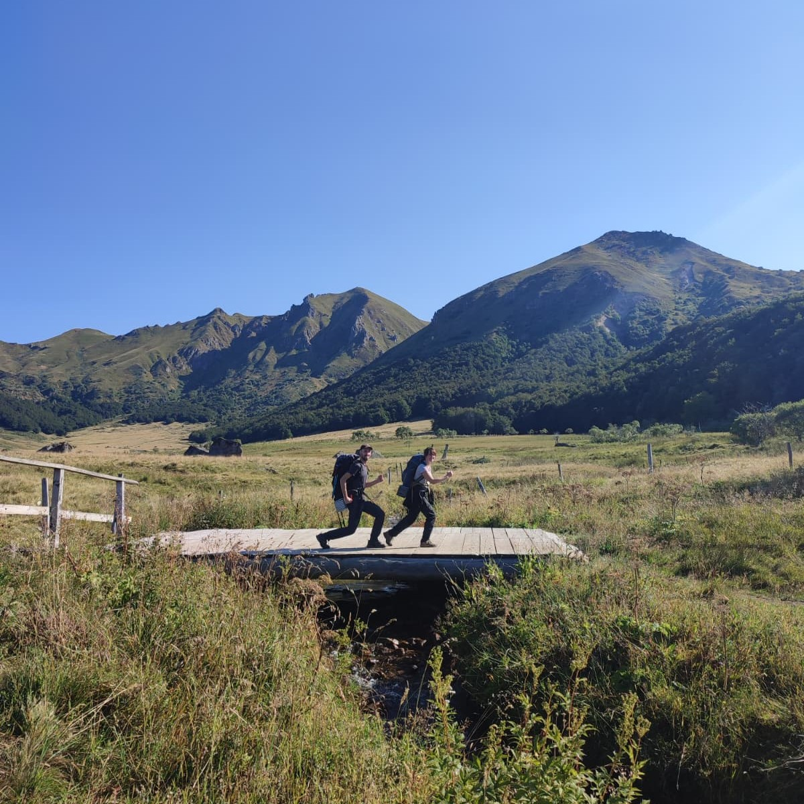

*Départ de la randonnée du Puy de Sancy*

Parfois, le besoin d’aventure se ressent, physiquement. Comme une sensation de chaleur dans le ventre. Il y a des signes qui ne trompent pas : tout comme se lever à 1h du matin dans le silence assourdissant de la nuit pour assister à un lever de soleil, prendre la voiture après le boulot et rouler jusqu’à la tombée de la nuit, aucun doute, c’est un signe d’une grande aventure à venir. Ce récit ne risque pas d’être sponsorisé par la marque de sport la plus répandue en France, car leur application nous a bien fait galérer. Mais quelque part, est-ce que ce ne sont pas ses moments de difficultés, accompagnés de nos amis, qui créent les plus beaux souvenirs ? 

On voulait partir pas trop loin, qu’il y ait un peu d’altitude, que l’on puisse faire l’aller-retour en un week-end. Après avoir farfouillé l’internet, le Puy de Sancy nous a paru comme une évidence. On a trouvé le tracé GPS sur l’application de Décathlon. Je ne savais même pas qu’ils proposaient ce genre de service. Bon, comme ce n’est pas aussi populaire que VisoRando, il n’y avait pas beaucoup de retours sur le tracé que nous avions choisi. Quelques commentaires annonçaient que les randonneurs avaient galéré à trouver le chemin. Malgré ces avertissements, on s’est dit que ça allait le faire. On a fait le plein de plats lyophilisés, de pastilles pour purifier l’eau, d’une bonbonne de gaz et de nos meilleurs duvets. Rien ne pouvait nous stopper.

*Traverser le pont avec style !*

Les premiers kilomètres sont grisants. La nature s’éveille et nous en même temps. Nous marchons silencieusement, accompagnant le soleil dans ses premières lueurs. Les oiseaux chantent, ça sent bon les fleurs, les arbres et le fumier. Je prends conscience qu’il n’y a pas autant d’odeurs dans notre quotidien, en pleine ville. On traverse des petits bois, on gravit quelques dénivelés, on déguste notre premier repas, la vie est belle. Malheureusement, les chaussures de M lâchent. Une bouche s’est formée au niveau de la semelle et les chaussures tirent la langue. L’aventure prend un tout autre tournant. Les employés des remontées mécaniques proposent de nous offrir gentiment la descente afin d’atteindre le village en contrebas pour acheter une nouvelle paire. R.I.P les vieilles godasses, elles auront fait leur temps.

C’est avec de nouvelles chaussures et plein d’entrain que nous reprenons notre chemin. On a encore pas mal d’heures de marche pour tenir la cadence qui nous est imposée. On traverse des plaines semblables à celles du Seigneur des anneaux. On s’amuse à courir tels des Hobbits pourchassés par des Orcs. On fait de petites erreurs d’inattention qui rallongent un peu plus notre itinéraire. Il nous arrive de marcher à quelques mètres du tracé, en se disant qu’on va le rattraper plus loin, mais plus loin, on ne le rattrape pas. Nous sommes déviés par des barbelés que l’on doit traverser en passant  d’abord nos sacs d’une dizaine de kilos avant de ramper pour ne pas se griffer ou s’électrocuter. Parfois même, nous devons faire de gros détours parce qu’un taureau nous barre la route (et vu la taille des bestiaux, on n’a pas trop envie de les déranger). 

*La station du téléphérique du Sancy*

La journée est longue, on doit trouver rapidement un endroit où dormir, mais c’est assez compliqué car nous sommes dans un parc protégé où il est interdit de camper. Entre les champs privés qui n’apparaissent pas sur notre carte, les limites du parc qui ne sont pas faciles à déterminer et, surtout, le fait qu’on ne marche pas sur un chemin officiel, notre moral est mis à l’épreuve. On finit par trouver un endroit, dans un champ avec des vaches, en bordure de parc. On monte notre bivouac vers 20h, en essayant d’être assez discrets pour ne pas qu’on vienne nous déloger. On mange un bout rapidos et on s’écroule dans nos tentes. À un moment on entend un bruit chelou qui me fait penser à un dragon. Les copains, dans la tente d’à côté, nous disent que c’est un cerf. J’avais jamais entendu ça et j’avoue que ça fait un peu flipper quand on ne connaît pas.

La première journée était cool. La deuxième était magique. Pourquoi ? Le lever du soleil. 
Je sais que je fais une fixette avec les levers et les couchers de soleil, et que je bassine tout le monde avec la « lumière orange » (je ferai un article dessus un jour), mais le matin de la deuxième journée, nous avons vécu un moment de pure contemplation. Fraîchement sortis de nos tentes, le soleil se met à caresser nos visages à moitié endormis. Autour de nous, les herbes brûlées de la veille se transforment en épis de blé dorés. Quelques montgolfières dans le ciel partagent l’instant avec nous. Et ce silence, que l’on n’ose briser, rend ce moment encore plus unique. Là, avec nos amis, on se regarde. De grands sourires sur nos visages. On prend des photos, un café, sans mot dire. On est conscients de la chance qu’on a. Et même si l’on voudrait que le temps s’étire pour profiter toujours plus de cet instant, il nous faut repartir, car le voyage est encore long. 

*Un magnifique lever de soleil avec des montgolfières*

Nous avons décidé de raccourcir notre itinéraire. Initialement, nous devions faire à nouveau une vingtaine de kilomètres avec pas mal de dénivelé. Mais depuis notre lieu de bivouac, on a eu l’opportunité de retirer une partie du trajet tout en gardant une jolie marche sur des crêtes, pour un total de 12km. Nous sommes déjà très heureux de notre randonnée, nous n’avons aucun objectif de performance. Le but, pour nous, c’est de prendre du plaisir. Et puis, raccourcir notre trajet voulait également dire : avoir le temps de passer à la fromagerie pour acheter du Saint-nectaire. Ça c’est aussi un bel objectif.

Par chance, nous avons encore un temps magnifique. La deuxième journée comporte un peu plus de dénivelé, mais on a une énergie en nous qui nous ferait presque oublier l’effort. On partage. On projette. On se dit qu’on reviendra. Parce qu’il y a encore tant d’endroits à découvrir, tant d’opportunités. Ce massif est vraiment magnifique, on se régale. On achève notre boucle avec une grande joie. On a un goût de reviens-y. Depuis notre retour de voyage avec M, j’ai envie de continuer à vivre des aventures. Il y a de belles expériences à vivre à tout moment, faut-il encore se lancer, accepter l’inconnu, sauter par-dessus le ruisseau, emprunter de nouvelles voies, expérimenter. Mais surtout, surtout, partager. 

Merci les amis pour cette belle randonnée. 