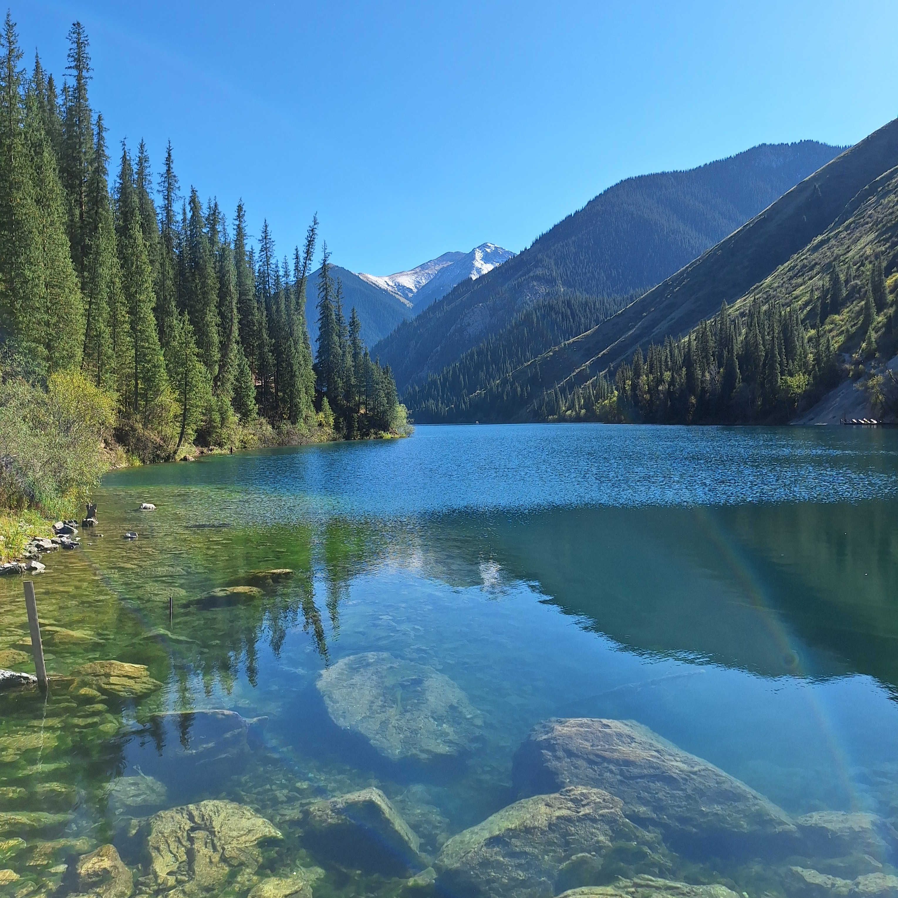
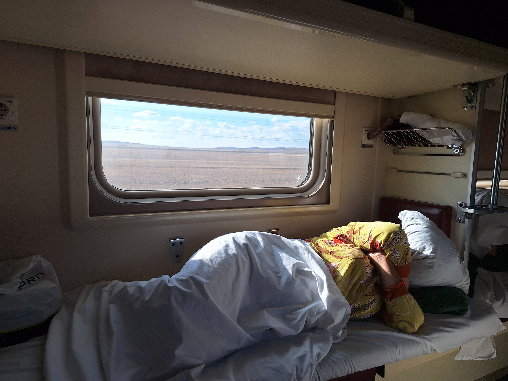
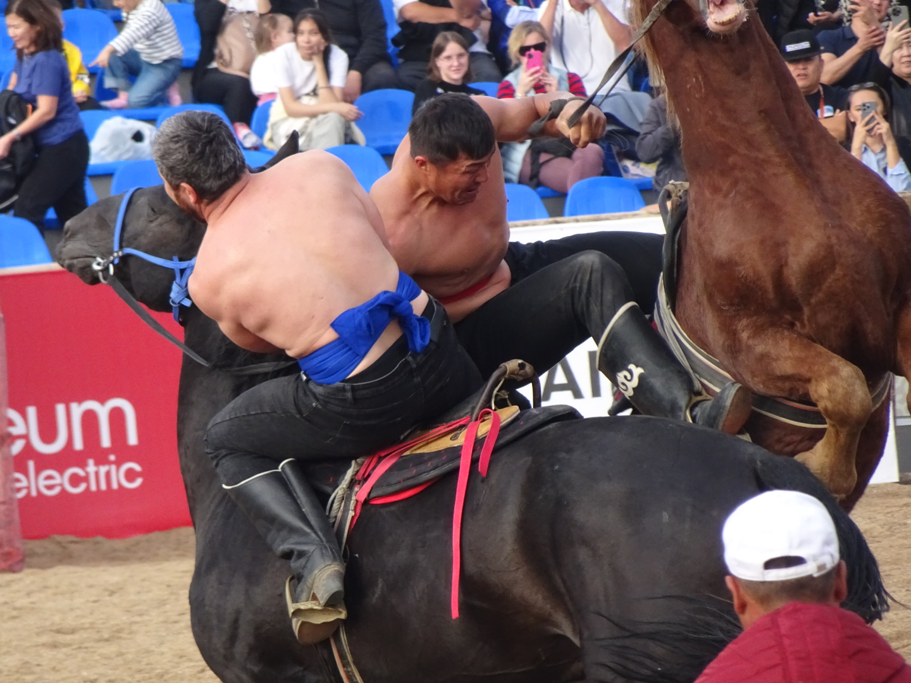

Notre séjour au Kazakhstan se termine aujourd'hui. C'est un vaste pays et je sais que nous n'avons qu'effleuré sa surface. Je vais quand même dresser un petit bilan de notre ressenti et nos expériences. 

Le Kazakhstan. Nous ne l'avons pas choisi par hasard. Cette année, la 5ème édition des World Nomad Games se déroulait à Astana, capitale du Kazakhstan. C'était quelque chose qui nous faisait terriblement envie. Pouvoir être aux premières loges de sports dont on ignore tout. La cérémonie d'ouverture était grandiose, les différentes compétitions étaient très intéressantes à découvrir. Tout cela, nous l'avons partagé avec vous. Mais il y a quelque chose que vous n'avez peut-être pas perçu et qui nous a marqué tout au long de notre séjour : le Kazakhstan, c'est grand. (Et ça rime en plus) 

*Les beaux lacs proche d'Almaty - Kolsai Lake*

Pas évident d'explorer les nombreuses curiosités que ce pays a à nous offrir. Les villes telles que Almaty et Astana prennent du temps à parcourir. Cette dernière est d'ailleurs considérée comme la Dubai de l'Asie Centrale, avec d'immenses buildings plus originaux les uns que les autres. Pour relier ces deux villes, nous avons découvert cette merveille qu'est le train de nuit. Il faut dire qu'avec un peu de pratique, on est vite devenus des experts. On connaît les bonnes places, l'emplacement de l'eau chaude pour le thé, comment avoir le train au meilleur prix... Bon par contre, je ne sais pas ce qu'il s'est passé avec le dernier trajet, mais le train était vieux, il vibrait de partout, on n'a pas beaucoup dormi. Il va falloir s'y habituer je crois. 

*Le meilleur transport du pays : le train*

Vous saviez qu'il existe une zone de décollage pour les fusées et qu'on peut avoir la chance d'en voir une s'élancer vers l'espace ? Et qu'il était possible, il n'y a pas si longtemps, de visiter un ancien site d'essais atomiques ? Ou encore que vous pouviez croiser dans l'un des nombreux parcs nationaux un léopard des neiges, un ours brun ou encore une antilope. Tout cela on ne l'a pas vu, par choix, mais également par manque de temps et d'organisation. Je reste persuadé aujourd'hui que le Kazakhstan est un pays riche en découvertes, mais qu'il vaut mieux arpenter avec son propre véhicule. 

*La fameuse lutte à cheval aux Wolrd Nomad Games - Astana*

Par contre, si vous souhaitez visiter ce pays, il va falloir vous faire des épaules et jouer des coudes, parce que les Kazakhs ils n'ont pas le temps d'attendre. C'est assez perturbant et parfois agaçant de se faire bousculer, piétiner. Il ne faut pas s'attendre à un sourire et parfois même un "bonjour" ou un "merci". En voyage, il faut savoir aussi prendre du recul et observer, comprendre, accepter les différences culturelles. Malgré ça, nous avons quand même reçu de la part de certains des gestes d'une infinie gentillesse et d'une spontanéité très touchante. Il y a du bon partout sur cette terre et il vaut savoir le garder en mémoire. 

*De jolis costumes et de beaux sourires - Astana*

Dans les derniers faits marquants, les expérimentations et les découvertes, voici une petite liste : 
- On a fait une soirée quiz en Russe dans un bar, et on a eu quelques réponses (merci google lens), 
- Je me suis fait tondre à 13mm par un coiffeur fan de Mbappé, 
- Il y a un restaurant coréen qu'il vaut mieux éviter à Almaty si vous tenez à votre bide, 
- Dans pas mal d'endroits ils n'auront pas la monnaie à vous rendre (et kaspi c'est kaspieds) 
- Pour eux, il n'y a aucun souci à passer un appel à 3h du mat' et parler comme s'il n'y avait personne dans le dortoir. 