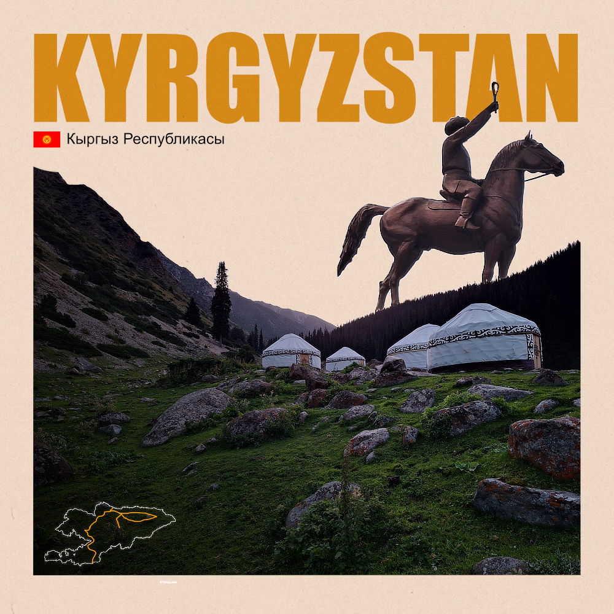
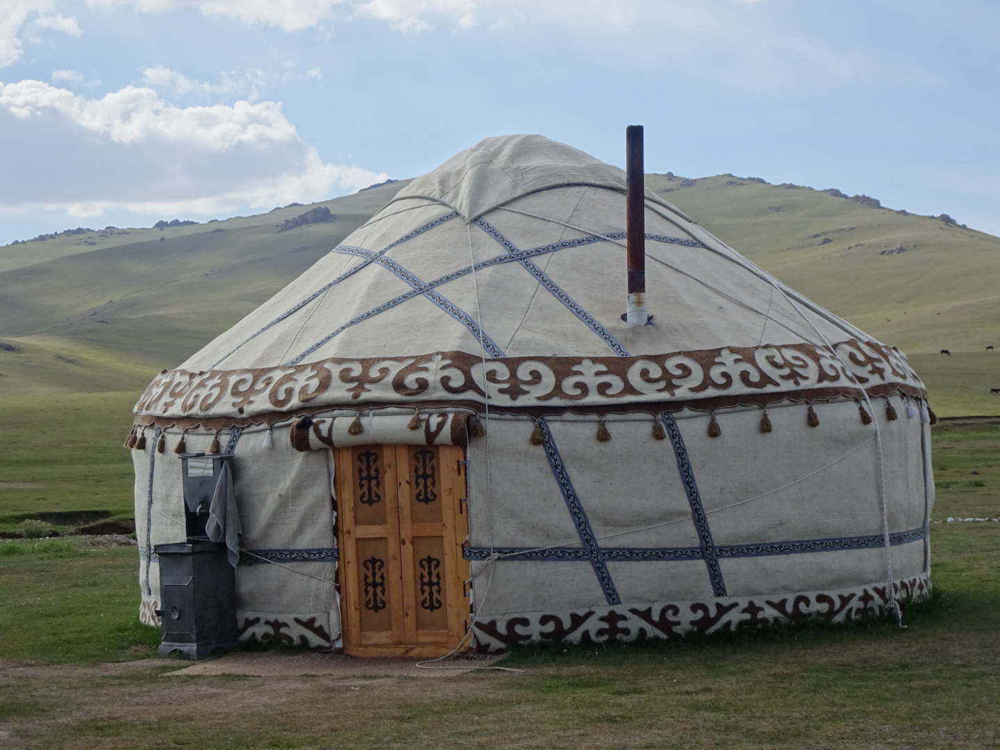

N'est-il pas magnifique le drapeau du Kirghizstan ? 
Les rayons du soleil symbolisent les 40 tribus kirghizes et en son centre, le tunduk. Il représente le haut de la yourte mais c'est surtout un symbole d'unité, qui engage tout le monde à avancer ensemble.

Le tunduk c'était aussi le nom de notre première auberge. Point de départ de notre année de voyage. C'est le moment de dresser un petit bilan après 24 jours dans ce pays qui, je pense, aura placé la barre très haute. 

*Une jolie petite yourte avec de beaux motifs - Son Kul*

J'ai lu plusieurs fois que les voyageurs trouvent les Kirghizes froids, impolis. Je peux comprendre ce ressenti, mais je ne le partage pas. C'est assez étonnant de voir que les Kirghizes ne communiquent pas entre eux, lorsqu'ils rentrent dans le bus, dans un magasin, à la caisse du supermarché. Ils ne disent pas un mot. On ne les entend pas s'énerver non plus. Nous les avons trouvés calmes, sereins. Les enfants aussi. Vous ne verrez jamais un enfant faire un caprice dans la rue. Ils sont disciplinés, ils écoutent. Tout ça, ça fait partie d'une éducation et d'une culture qui est radicalement différente de la nôtre. Durant ce voyage on en a beaucoup appris sur l'éducation, la famille, le mariage, la religion, le travail. Je prends toujours un réel plaisir à découvrir tous ces aspects de la vie de gens qui habitent à des milliers de kilomètres de chez moi.

*Le canyon des contes de fées - Skazka Canyon*

Est-ce qu'on a trouvé les Kirghizes froids ? Non pas vraiment. Durant notre périple, nous avons pu discuter avec nombre d'entre eux : un policier, un pharmacien, un manager de l'équipe costume d'un spectacle, des guides de montagnes, des gens dans la rue et puis Maftuna et Madina. Tous étaient préoccupés de notre bien-être dans leur pays. Tous espéraient que les gens nous traitent bien. Tous voulaient savoir ce que l'on avait aimé ou non dans leur culture. De nombreux enfants étaient heureux de pouvoir se présenter, nous serrer la main, avoir un contact. Et ça, bah ça fait chaud au cœur. 
Alors oui, ils ne sont pas tous comme ça. Et ceux avec qui nous ne pouvions communiquer semblaient gênés, presque timides face à cette barrière de langage. Nous n'avons jamais ressenti de pressions, d'agressions de leur part. À mes yeux, les Kirghizes sont vraiment sympas. 

*Les montagnes célestes qui craquent, en arrière plan - Ala Kul*

Il y a certainement plusieurs facteurs à ça, personnellement j'en vois un : le tourisme n'est pas encore très développé ici. Alors s'il vous plaît, n'y allez pas. (Enfin si, allez-y, c'est trop stylé). Les paysages sont magnifiques ici, les montagnes, les canyons, les lacs. Les amoureux de la nature tomberont amoureux une nouvelle fois. 

*Les traditionels petits pains ronds d'Asie Centrale - Osh Bazar*

Il y a encore tant de choses que j'aimerais dire sur ce pays et ses habitants, je ne vais pas trop m'étendre. Je vais simplement dresser une petite liste des trucs cool qu'on a découverts et qui m'ont marqué :
- Les Kirghizes n'utilisent pas de couteau pour manger,
- Ils ne boivent pas d'eau, que du thé,
- À table on sert toujours les hommes en premier et on ne met pas beaucoup de thé dans la tasse (resservir quelqu'un souvent veut dire que l'on a envie de lui accorder du temps),
- Les Kirghizes ne s'assoient jamais par terre, ils font la pose kirghize et c'est vachement impressionnant,
- La bague de fiançailles est remplacée par des boucles d'oreilles,
- Les Kirghizes fabriquent leur propre Cognac et ils adorent ça,
- Les conteurs de Manas sont hyper forts, on en a rencontré un qui un jour a improvisé 56h sans s'arrêter sur Manas,
- Les taxis adorent coller des hélicoptères en plastique sur leur tableau de bord.
