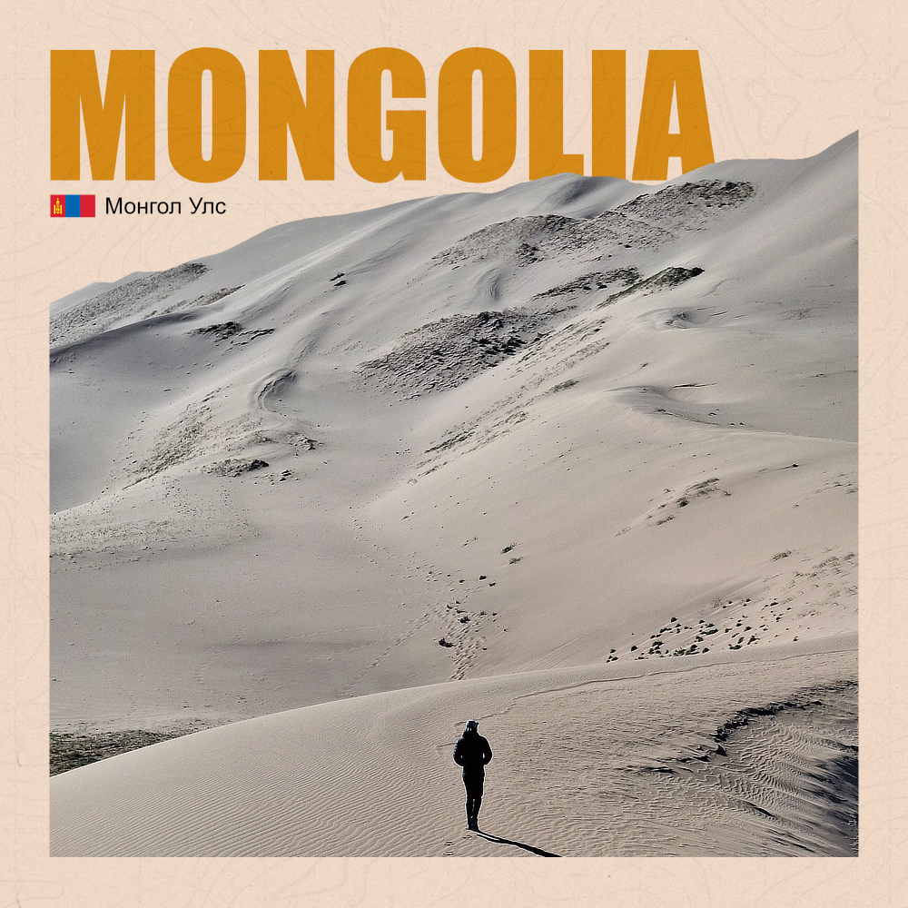

import Carousel from '../../components/Carousel.astro';

La Mongolie, c'était incroyable. La Mongolie, c'est un gros gros coup de cœur. 

Mais la Mongolie, on ne peut pas dire que c'est un pays facile. Déjà, il n'est pas évident à visiter en tant que voyageur. Il y a peu de routes, seulement 20% d'entre elles sont goudronnées. Il existe des bus pour les longues distances, bus qui ramènent toujours au même point : Ulaanbaatar. 

Si vous voulez découvrir ce pays par vous-même il faut être bien accroché. Vous avez de grandes chances de vous perdre, de grandes chances de heurter des animaux, de grandes chances d'être en danger... Parce que la nature ici est rude, inhospitalière. Le climat est extrême, les températures peuvent descendre jusqu'à -40°C en hiver, c'est inhumain. Et pourtant, pourtant, il y a des gens qui vivent ici, des gens qui vivent depuis des millénaires dans des conditions difficiles, des gens qui ont un train de vie qu'on ne peut imaginer, nous, bien confortablement assis dans nos canapés. 

Ces gens-là m'ont impressionné, bluffé, de par leurs connaissances, leur humilité, leur gentillesse. Les nomades, qui s'occupent de leur bétail et prennent soin de leur famille n'ont rien à apprendre de nos sociétés. Ils se nourissent de leurs bêtes, ils réparent leurs véhicules, ils savent faire du feu, cuisiner. Ils n'ont absolument pas besoin de GPS, ils savent se repérer, comprendre la nature. Transportant leur habitat de paysage en paysage, au gré des saisons, ils s'adaptent à leur environnement. Ils sont autonomes. 

Nous avons beaucoup à apprendre à leur propos, mais je pense qu'il y a certaines choses qui resteront un mystère. Juste avant d'arriver dans le pays, j'ai lu quelque chose qui me marquera pour toujours : "En Mongolie, on attend, souvent. On ne sait pas pourquoi on attend. Mais on doit apprendre à attendre sans savoir pourquoi". Ce sont les mots d'une jeune française qui a vécu 1 an chez les nomades. Au début, ce passage m'a fait rire. Mais après avoir passé quelques jours dans ce merveilleux pays, j'ai compris. 

Les Mongols n'ont pas vraiment d'horloge ou de calendrier. Combien de fois notre chauffeur, "Papy Brossard", nous a trompés sur les heures ? (le réveil à 5h20, il pique encore) Combien de fois les bus sont partis à l'heure ? Est-ce que le film d'hier soir à commencé à l'heure prévue ? Est-ce que ça les dérange ? Qui est-ce que ça gêne ? Nous ?

C'est une des plus grandes leçons que je retiendrai de ce voyage, ici, en Mongolie. En vivant à leurs côtés, j'ai compris qu'il n'était pas possible d'organiser sa journée, de l'optimiser. Parce qu'en tant que nomade, ce n'est pas toi qui décide du temps, mais la nature. Quand on se déplace dans la steppe, qui sait combien de temps cela va prendre ? Qui sait si on sera à la maison le soir ? Qui sait si on arrivera à aller à la piscine, faire des courses, récupérer les enfants à l'école et regarder notre feuilleton ? Même à Ulaanbaatar, les transports sont tellement longs. Mais personne ne râle. Personne. Au final, à ne pas optimiser et en adoptant "l'horloge mongole", ne sont-ils pas plus détendus ? 

Je sais que nous ne vivons pas dans les mêmes sociétés, nous n'avons pas les mêmes contraintes, et c'est exactement ça que j'aime découvrir en voyageant.

Une petite liste en vrac d'autres trucs qui m'ont marqué : 
- Toyota prius = 99,9% des voitures en Mongolie,
- Les magasins sont composés, en majorité, de bonbons, gâteaux et chips,
- N'importe qui peut rentrer dans ta yourte sans toquer, c'est normal,
- Pendant les élections, il est impossible d'acheter ou consommer de l'alcool (et nous, on a été dans un bar à vin pour boire un thé),
- Il y a 65 millions d'animaux pour 3,5 millions d'habitants (dont 1,7 million à UB),
- Caffé Béné, c'est de la balle. 

Aujourd'hui, on quitte ce magnifique pays. Un pays aux mille couleurs et textures, couvert d'un ciel bleu infini. J'ai été émerveillé par la beauté des paysages. Mais je le quitte en ayant beaucoup appris, et, en tant que voyageur/nomade, j'espère garder avec moi, et pour longtemps, ces enseignements qui m'ont plus que touché. 

"Bayarlalaa Mongolia" ❤️

<Carousel images={['../assets/Mongolia-2.jpg', '../assets/Mongolia-3.jpg', '../assets/Mongolia-4.jpg', '../assets/Mongolia-5.jpg', '../assets/Mongolia-6.jpg', '../assets/Mongolia-7.jpg', '../assets/Mongolia-8.jpg', '../assets/Mongolia-9.jpg', '../assets/Mongolia-10.jpg', '../assets/Mongolia-11.jpg']} client:load />